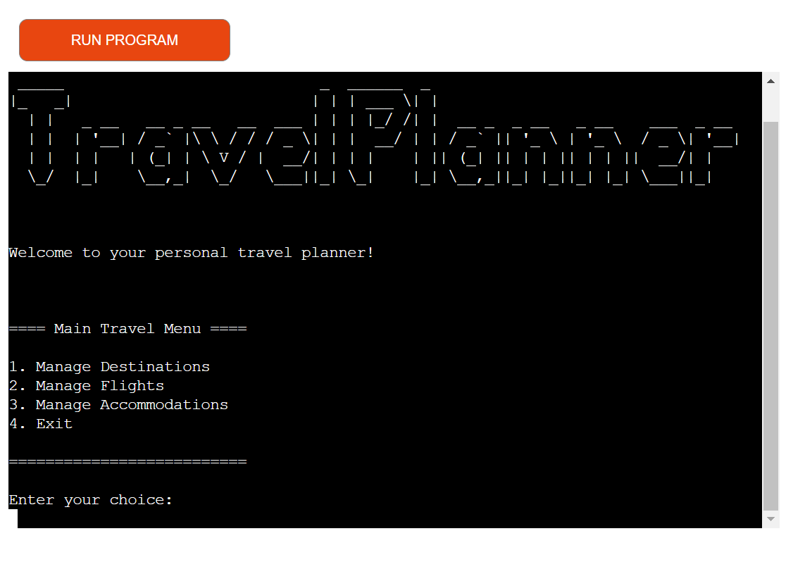

# **Travel Planner**

Travel Planner is a command-line application that allows the user to manage their travel plans, including destinations, flights and accommodations. The application presents menus with numbered options for the user to choose from. Clear prompts and instructions guide the user through each interaction and error messages will be displayed if the user enters invalid input or performs an action that is not allowed.

The live link for the application can be found here - https://travel--planner-68934267527b.herokuapp.com/

# Table of Contents
- [Design](#design)
- [Features](#features)
  - [Existing Features](#existing-features)
    - [Destination Management](#destination-management)
    - [Flight Management](#flight-management)
    - [Accommodation Management](#accommodation-management)
    - [Data Validation and Error Handling](#data-validation-and-error-handling)
  - [Future Features](#future-features)
- [Data Structure](#Googlesheet)
- [Testing](#testing)
  - [Validator Testing](#validator-testing)
  - [Unfixed Bugs](#unfixed-bugs)
- [Frameworks, Libraries and Programs](frameworks--libraries-and-programs)
- [Deployment](#Deployment)
- [Credits](#Credits)

# Design
### Flowchart

[Lucid app](https://www.lucidchart.com/) was used to plan the logic for this project

# Features

## Existing Features:
The first thing the user sees is the Travel Planner logo (ASCII text art), a welcome message, and the main travel menu for the user to manage their travels, specifically their destinations, flights and accommodations. The numbered options in the menus allow for easy navigation through the application.

### Destination Management
In the destination management menu, the user has the following options to manage their destinations:
- The user can choose to add a new destination by entering the city and country names. The application will store the destination and provide a confirmation message to the user.
- The user can view their list of destinations, which will display the city and country names.
- If the user decides to remove a destination, they can select it from the destinations list, and the application will delete it.

### Flight Management
In the destination management menu, the user has the following options to manage their destinations:
- The user can select a destination from the destinations list and add flight details for that destination. The application will then prompt the user to enter the airline, flight number, departure date, and time for that destination.
- Once the flight details are added, they can be viewed by the user.
- If the user cancels their flight for a specfic destination, they can remove the flight details for that destination.

### Accommodation Management
In the destination management menu, the user has the following options to manage their destinations:
- Similar to flight management, the user can add accommodation details for a specific destination. They can then add the hotel name, check-in date, and check-out date for that destination.
- For each destination the user can view the accommodation details.
- If the user changes their lodging plans for a specific destination, they can remove the accommodation details for that destination.

### Data Validation and Error Handling
Throughout the application, user input will be validated. If the user tries to perform an action that is not allowed or provides incorrect input, informative error messages will be displayed to guide them.

## Future Features
- User Registration
  - When the application starts, it will prompt the user to either log in with their existing account or create a new one.
  - If the user chooses to create a new account they will be asked to enter their name and email address.
  - The application will validate the email address format and check if it's unique
  - Once the registration is successful, the user can proceed to the main travel menu
- Activity Management
  - The user can add multiple activities or attractions they plan to visit at a specific destination.
  - They will enter the activity name, and it will be added to the list for that destination.
  - The user can view the list of activities and remove any if their plans change.

# Data Structure
Google Sheet API was used to store, en keep track of, the following data:
- Destination Data: Each destination has attributes like city and country names.
- Flight Data: For each destination, the flight details includes airline, flight number, departure date, and time.
- Accommodation Data: Each destination has accommodation details, including the hotel name, check-in date, and check-out date.

# Testing

Testing was done by trying to break the application. 

## Validator Testing
The code for this project was tested using [PEP8](http://pep8online.com/)

## Unfixed Bugs

# Frameworks, Libraries and Programs
- [Gspread](https://docs.gspread.org/en/v3.7.0/api.html) -  enable opening, accessing and reading of googlesheet data
- [Credentials](https://pypi.org/project/credentials/) -  serve as unique identifiers required to access API
- [Art](https://pypi.org/project/pyfiglet/0.7/) -  create the Travel Planner logo (ASCII text art)
- [Heroku](https://id.heroku.com/)
- [GitPod](https://www.gitpod.io/)
- [GitHub](https://github.com/)

# Deployment
This application was deployed to Heroku. The steps to deploy are as follows:
1. Create and account and log in to Heroku
2. from the Heroku dashboard click "Create new app"
3. Give app an unique name and select region
4. Go to settings option
5. Create Config Var. 
    - First: Key is CREDS and value is entire creds.json file (copy/paste). Click add
    - Second: Key is PORT and value is 8000. Click add
6. Add buildpack (in this order). 
    - First: Add Python
    - Second: Add Nodejs
7. Go to deploy section, select "Github" and the correct repository, and link Heroku app to Github repository by clicking "Connect"
8. Set up automatic deploys or deploy manually.

# **Credits**

*[Back to top](#travel-planner)*